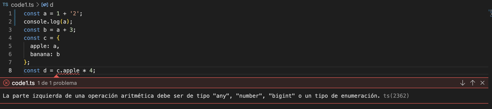

# Ejercicio 2

## Parte 1 - Code1.ts

1. Modificación para el TypeError: en la constante 'a', he modificado la operación de su interior de dos enteros (1 y 2, lo que permite a TS inferir el tipo de variable de 'a' como 'number') a un entero y un string (1 y '2', que permite a TS inferir el tipo de varialbe de 'a' como un String.) 
2. TypeError: La modificación anterior proboca que posteriormente, en la operación para asignarle valor a la constante 'd', salte el error devido a que no se puede realizar una operación aritmética con la parte izquierda siendo un String. 
3. Ventajas: Se nos indica que el valor no es del tipo esperado para el tipo de variable, operación etc. Dependiendo de la casuistica. Esto se traduce a un 'consejo', por aprte del código, de corrección donde se nos indica el error, la causa y las posible soluciones para una correcta implementación. 

## Parte 2 - Preguntas

1. (1 punto) Para cada uno de los valores del fichero code2.ts, ¿Qué tipo de datos inferirá TypeScript? Explica por qué se ha inferido este tipo de datos.

- a->
- b->
- c->
- d->
- e->
- f->
- g->
- h->

2. (1 punto) ¿Por qué se dispara cada uno de los errores del fichero code3.ts?

3. (0.5 puntos) ¿Cuál es la diferencia entre una clase y una interface en TypeScript?

